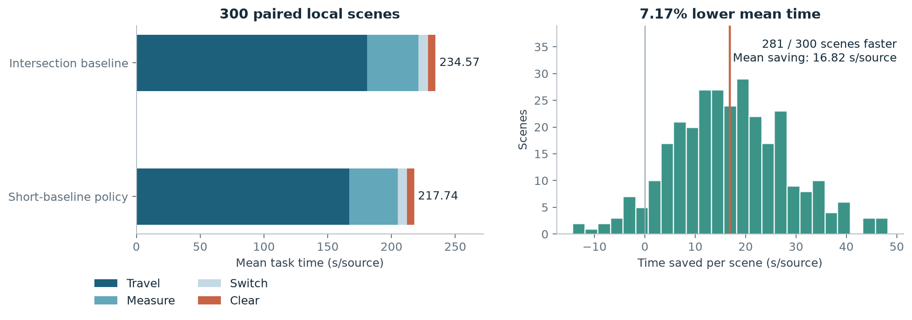
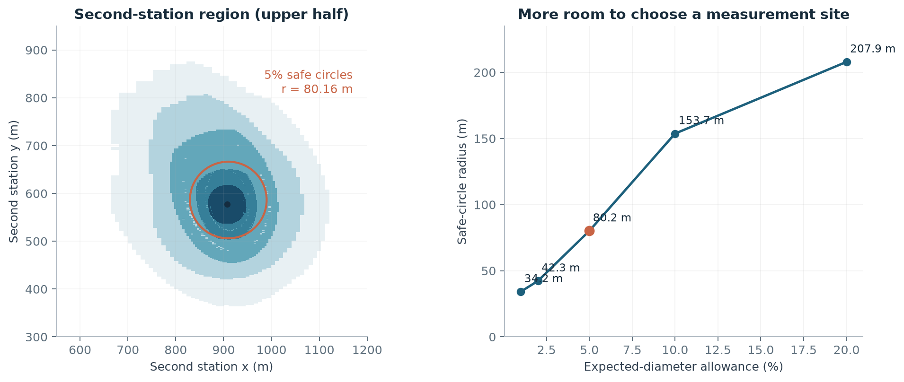
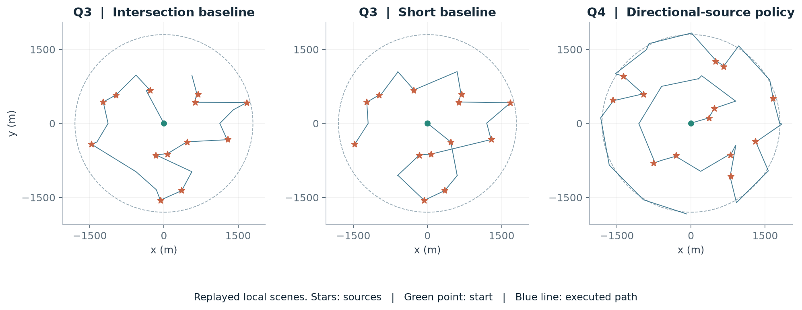

# 无线电干扰源定位与清除

**2026 全国大学生数学建模竞赛 B 题｜几何定位 · 贝叶斯选点 · 主动感知 · 路径规划**

在目标位置与数量未知、测向存在误差、部分信号具有方向性的环境中，规划机器狗的测量与移动，完成全部干扰源的发现、定位和清除。项目将定位精度与行动成本放进同一套决策流程：先维护源位置的可行区域，再选择有信息价值的测点，最后联合安排搜索站和清除点的访问顺序。

## 项目结果

| 任务 | 方法 | 关键结果 |
|---|---|---|
| 测向区域计算 | 半平面交、区域直径、最小包围圆 | 用可复算反例区分定位区域大小与一次清除条件 |
| 二次测向选点 | 贝叶斯更新、条件蒙特卡洛、整块区域验证 | 5% 期望精度冗余下，提取约 **80 米**半径的选点圆，可选内域约 **9.71 万平方米** |
| 全向多源任务 | 覆盖搜索、6 米短基线、开放路径与失败恢复 | 300 场本地配对实验平均节时 **7.17%**，**281/300** 场更快，两方案均全部清除 |
| 定向多源任务 | 凸包覆盖、整数四叉树校验、共享误差后验与滚动排路 | 构建 **48 套 20 站**候选布局，在 1770 米支持域内完成连续定向覆盖验证 |
| 正式测试 | 第三、四问各 3 场 | 分别清除 **40、37 个源**；场次等权平均 **212.34、426.91 秒/源** |



第三问把平均每源时间从 **234.57 秒降至 217.74 秒**，节省 **16.82 秒/源**，配对均值节时的 95% 区间为 **[15.54, 18.11] 秒/源**。移动、检测和换频的联合优化，使局部定位方法真正转化为任务效率。

## 如何解决这个问题

1. **把方向变成区域。** 将带误差的示向转为半平面约束，维护与观测相容的源位置区域；用最小包围圆判断光学清除是否能覆盖整个区域。
2. **把下一次测量变成决策。** 根据首次观测更新位置与接收半径分布，对正常示向、近距和无信号三类反馈计算期望区域直径，找到精度好、选择余地大的测点区域。
3. **把搜索和清除放进同一条路线。** 在经过覆盖校验的搜索站上发现新源，利用局部误差场的平滑结构做短基线补测，并随观测更新访问顺序。
4. **把定向接收纳入几何与概率模型。** 用近站凸包处理未知发射朝向，以共享误差节点和接收历史优化补测与试清位置，结合覆盖检查与逐次清除回执完成任务。



红圈表示机器狗可选择的**第二测点区域**。在圆心首测、示向为正东的标准场景中，推荐点约为 `(907.43, ±577.08)` 米；5% 档期望直径阈值为 `52.763` 米。



## 快速复现

使用 Python 3.12 或更高版本，在仓库根目录运行：

```bash
python3 -m venv .venv
source .venv/bin/activate
python -m pip install -r requirements.txt
python scripts/reproduce.py
```

Windows 激活环境使用 `.venv\Scripts\activate`。第二问会在检测到 `clang++` 时自动编译数值加速内核；没有编译器时使用 Python 实现。

默认流程依次完成第一问几何检查、结果汇总、第二问候选圆重建、第三问小批配对回放、第四问完整场景回放和图表生成。中间输出保存在 `outputs/`，展示结果保存在 `results/`。

```bash
# 重跑第三问全部 300 场配对实验，合计 600 次策略运行
python scripts/reproduce.py --full

# 仅从随仓库保留的表格和轨迹重建展示图
python scripts/reproduce.py --figures-only
```

[完整复现说明](docs/reproduction.md)包含各步输入、输出、运行方式与验收标准。

## 仓库结构

```text
src/
  q1.py             测向交集、直径与最小包围圆
  q2/               后验采样、全反馈期望、候选区域与数值内核
  search/           全向搜索、短基线、任务排路与本地仿真
  directional/      定向覆盖、共享误差后验、C20 组合策略
scripts/            统一复现、统计汇总与绘图入口
data/               候选区域、逐场结果、固定场景与执行轨迹
results/            汇总结果与五组展示图
docs/               方法、数据与复现说明
```

- [方法说明](docs/methods.md)：从观测模型到行动策略的完整链条。
- [结果与实验设计](docs/results.md)：正式成绩、配对实验、时间分解和统计口径。
- [数据与代码导航](docs/code-map.md)：数据字段、模块职责与建议阅读顺序。

## 实验设置

第二问以首次观测条件下的**期望可行区域直径**衡量精度，5% 冗余相对选定参考点的验证上界定义。第三问的 7.17% 来自固定 300 场本地配对场景；正式成绩单独保存在 `data/formal_results.csv`。第四问公开实现采用支撑材料中的 C20 组合策略，提供固定场景的完整本地回放；定向布局校验的源位置支持半径为 1770 米。
