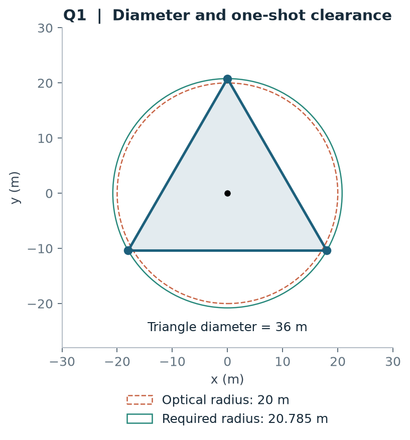

# 方法说明

## 问题与时间目标

每个干扰源占据一个独立频道；共有 20 个候选频道，实际源数在 10 至 16 之间。机器人在测点获得正常示向、近距或无信号反馈，并在距离源 20 米内完成光学定位清除。源的接收半径固定在 1000 至 1500 米之间，同地点测角误差固定。

任务成本按实际动作累计：

$$T=L/5+5N_m+N_s+5N_c+3N_f.$$

其中 $L$ 为路程，$N_m$ 为测量次数，$N_s$ 为检测换频次数，$N_c,N_f$ 为成功、失败清除次数。程序维护每个频道的观测历史、位置区域与清除状态，随新反馈滚动决策。

## 第一问 几何定位

观测 $(S_i,\theta_i)$ 对应半宽 $\alpha=1^\circ$ 的扇区。记边界方向向量为 $u_i^-,u_i^+$，候选源 $X$ 满足

$$u_i^-\times(X-S_i)\ge0,\quad u_i^+\times(X-S_i)\le0.$$

每次观测因此生成两个线性约束。`constraints` 形成半平面，`solve` 枚举边界交点并验证可行性、检查衰退方向，`diameter` 求最远顶点对。最小包围圆通过单点、两点直径圆及三点外接圆候选枚举求出。

边长 36 米的等边三角形直径为 36 米，最小包围圆半径为 $12\sqrt3\approx20.785$ 米。这个反例使后续决策明确使用“包围圆半径不超过光学清除半径”作为一次覆盖的几何条件。

## 第二问 贝叶斯选点

先设定位置的面积均匀先验、接收半径均匀先验与有界角误差，再条件化到第一次正常示向。距离首次测点 $r>1000$ 米的位置，仅在接收半径至少为 $r$ 时可以产生这条观测，其位置权重乘以 $(1500-r)/500$。代码中称为 `taper`；`flat` 用作位置权重敏感性对照。

对第二测点 $Q$ 评价

$$M(Q)=\mathbb E[D(K_Y(Q))\mid I_1],$$

其中 $Y$ 包括正常示向、近距和无信号，$K_Y$ 是收到相应反馈后的位置可行集。固定源位置后，先对接收半径与第二次误差积分，再对位置后验抽样，得到条件蒙特卡洛估计。

开发阶段用粗网格与 Nelder–Mead 找推荐点，用四叉树划分候选站位空间；验证阶段用独立样本、几何上下包络和经验 Bernstein 界给整块区域分类。整块上界低于阈值的矩形构成候选内域。栅格距离变换从内域提取可选圆，扣除像素半对角线后得到半径下界。

标准场景推荐点为 $(907.429,\pm577.076)$ 米。5% 档阈值为 $1.05\times50.2507057=52.7632409$ 米，候选内域面积约 97141 平方米，选点圆半径下界约 80.17 米，展示采用向下取值 80.16 米。

## 第三问 短基线与联合路线

全向接收下，半径 1000 米的已扫描站点圆覆盖目标域，便可完成未知频道的发现检查。搜索布局采用原点加六个外围站；候选布局均先通过连续圆覆盖校验，再结合已发现源选择开放路径较短的一套。

局部误差场采用 150 米节点网格与 $s(t)=3t^2-2t^3$ 插值。在格点附近一阶误差梯度为零，小距离的方向差可以突出几何视差。沿示向左法向移动 $h=6$ 米：

$$\widehat r=-h/\Delta\beta,\qquad \widetilde X=q+\widehat r(\cos\beta,\sin\beta).$$

`scan_perp` 处理角度回绕、差值符号和坐标范围，再将估计投影回保守位置区域，作为访问与试清目标。失败清除会加入半径 20 米排除圆；`ray_intervals` 将新示向与区域相交并减去失败圆，`march_source` 执行短距离恢复。包围圆充分缩小后在圆心清除，末级网格覆盖处理剩余情况。

`choose_joint_task` 将搜索站与已知源组成统一待办列表；路线采用开放路径，以新位置和新观测重排。删除低收益的重复补测，减少定位绕行与检测费用，是实验收益的主要来源。

## 第四问 定向覆盖与后验规划

对源 $G$，取 1000 米内的近站集合 $S(G)$。未知半平面发射朝向下，发现条件写为

$$G\in\operatorname{conv}S(G).$$

若源在近站凸包内，对任意朝向，至少一个近站落在可接收半平面。`certify_layout_integer` 把站坐标转成整数毫米，对四叉树方块筛出覆盖整块的近站，并检查四角是否位于这些站的凸包内。48 套 20 站目录在 1770 米源位置支持域中逐套验证。

新源的短基线补测从合适的格点出发。`route_anchor_choice` 同时考虑接收概率与进出路程；`uniform_field_posterior` 以共享网格误差节点解释多条观测，并用 65536 个 Sobol 积分点生成位置权重。两角反演位置时以

$$1/|J_\theta(X)|=r_1r_2/|\sin(\theta_2-\theta_1)|$$

修正变量替换权重；所有正负接收反馈共用同一接收半径与发射方向。后验用于选择更顺路、清除成功概率更高的动作。

全局路线还纳入未发现源的分布、未来扫描费用与首次发现后的插入成本。局部探针用固定终点动态规划排序；组合版允许提出搜索站微调，候选站位通过整数覆盖校验后才采用。覆盖状态与清除回执共同构成结束条件。

## 模型参数与适用设置

| 参数 | 取值与用途 |
|---|---|
| 源活动域 | 题面半径 1800 米；本地场景生成与第四问布局使用 1770 米支持域 |
| 角误差 | 第一、二问使用 ±1°；执行时保守区域额外计入 0.005° 量化余量 |
| 误差场 | 150 米网格、固定节点值、三次平滑插值 |
| 清除半径 | 20 米；保守执行阈值留有数值余量 |
| 第二问评价 | 首次观测条件下的期望区域直径；候选域是该评价下的可选站位 |
| 排路目标 | 固定目标上的路径长度和基于后验的预计任务时间 |

这些设置把算法、数据和图表联系起来，也给更换噪声结构、目标域或动作费用时提供了明确的修改入口。
