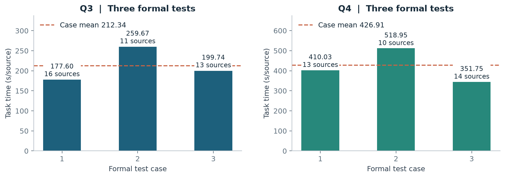

# 结果与实验设计

## 正式测试

| 问题 | 场次 | 清除数 | 秒/源 |
|---|---:|---:|---:|
| 第三问 | 1 | 16 | 177.5996 |
| 第三问 | 2 | 11 | 259.6686 |
| 第三问 | 3 | 13 | 199.7442 |
| 第四问 | 1 | 13 | 410.0296 |
| 第四问 | 2 | 10 | 518.9520 |
| 第四问 | 3 | 14 | 351.7455 |

第三问累计清除 40 源，第四问累计清除 37 源。README 报告三场等权平均：$\bar a=\sum_i a_i/3$，分别为 212.34、426.91 秒/源。若用源数加权，计算 $\sum_i n_i a_i/\sum_i n_i$，第四问为 417.41 秒/源。

`data/formal_results.csv` 来自提交论文正式成绩表及本地保存的结束汇总；第三问使用论文保留的四位小数。正式测试档案与本仓库的可执行本地回放分别保存。

## 第三问 300 场配对比较

| 指标 | 交会定位基准 | 短基线方案 |
|---|---:|---:|
| 场景数 | 300 | 300 |
| 清除数 | 3904 / 3904 | 3904 / 3904 |
| 等权平均秒/源 | 234.5654 | 217.7435 |
| 场间标准差 | 33.4609 | 32.4693 |

每个场景固定源位置、数量、接收半径与误差场，两种策略独立执行。以整场为配对单位，节时量为 $d_i=a_i^{base}-a_i^{method}$。

- 平均节时：16.8219 秒/源。
- 相对下降：$(234.5654-217.7435)/234.5654=7.1715\%$。
- 281 场节时，占 93.67%。
- 配对均值节时的 95% t 区间：$\bar d\pm t_{0.975,299}s_d/\sqrt{300}=[15.5353,18.1084]$。

场景表保留在 `data/q3/paired_300.csv`，复算入口为 `scripts/summarize.py`，重新执行策略用 `src/search/evaluate.py`。策略只接收普通动作回执，评估器用真位置检查区域包含关系与清除条件。

## 第二问 从参考点到候选内域

| 冗余 | 期望直径阈值 m | 内域面积 m² | 选点圆半径下界 m |
|---|---:|---:|---:|
| 1% | 50.7532 | 10498.87 | 34.1790 |
| 2% | 51.2557 | 30075.28 | 42.2903 |
| 5% | 52.7632 | 97141.14 | 80.1697 |
| 10% | 55.2758 | 189938.14 | 153.7219 |
| 20% | 60.3008 | 350775.80 | 207.9401 |

5% 档两个圆心分别约为 `(907.25, -594.25)`、`(909.75, 586.25)` 米。相对参考上界设定阈值后，矩形块验证与保守栅格提取把一个推荐坐标转化成具有操作余地的站位区域。

## 第四问 分层统计与回放

`data/q4/episodes.csv` 保留不同策略的逐场耗时及移动、检测、换频、成功清除、失败清除五项成本。I、J 两组都固定 13 源，按定向源数 $D=1,\ldots,13$ 分层；I 组每层 10 场，J 组每层 30 场。

| 组别 | 策略 | 场景数 | 等权秒/源 |
|---|---|---:|---:|
| I | 历史基准 v5 | 130 | 410.7087 |
| I | 简化方案 | 130 | 409.3416 |
| I | 组合方案 | 130 | 408.3541 |
| J | 历史基准 v5 | 390 | 406.1363 |
| J | 简化方案 | 390 | 404.7196 |

汇总程序按层有放回抽样 40000 次，再对 13 层等权平均，复算保存的置信区间。仓库中的 C20 组合策略还提供完整固定场景回放：13 源全部清除，408.3913 秒/源，214 次检测、199 次检测换频、5 次失败清除。

## 验证设计

几何模块通过解析反例、独立裁剪和随机案例交叉核验；期望模块对比直接蒙特卡洛与条件积分，并检查三类反馈的真源包含关系；策略层使用场景固定的配对比较与动作级时间核算。这样的设计能把收益定位到移动、测量和恢复环节，而不只给出一个最终分数。
